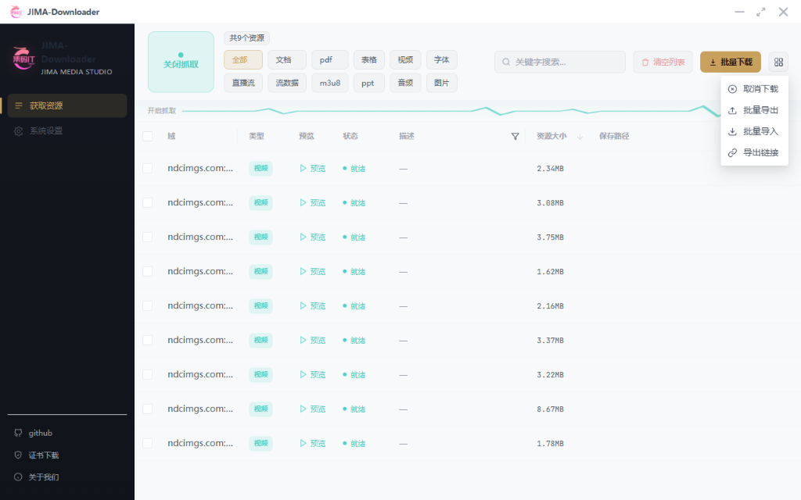
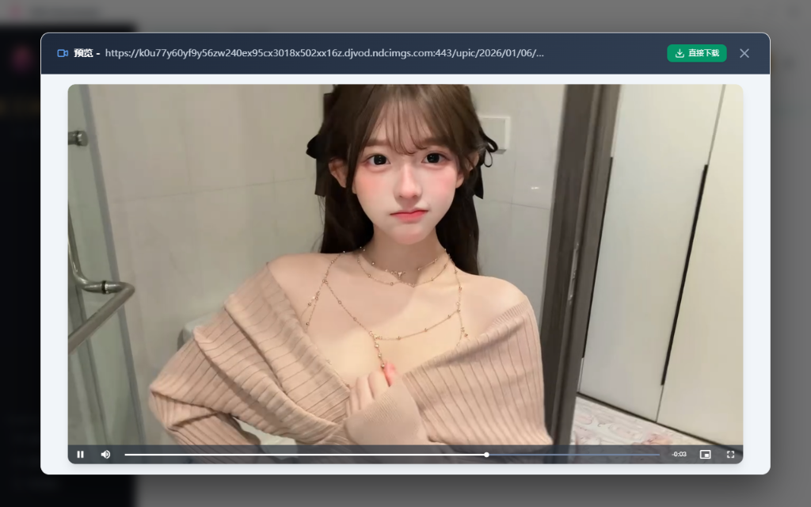
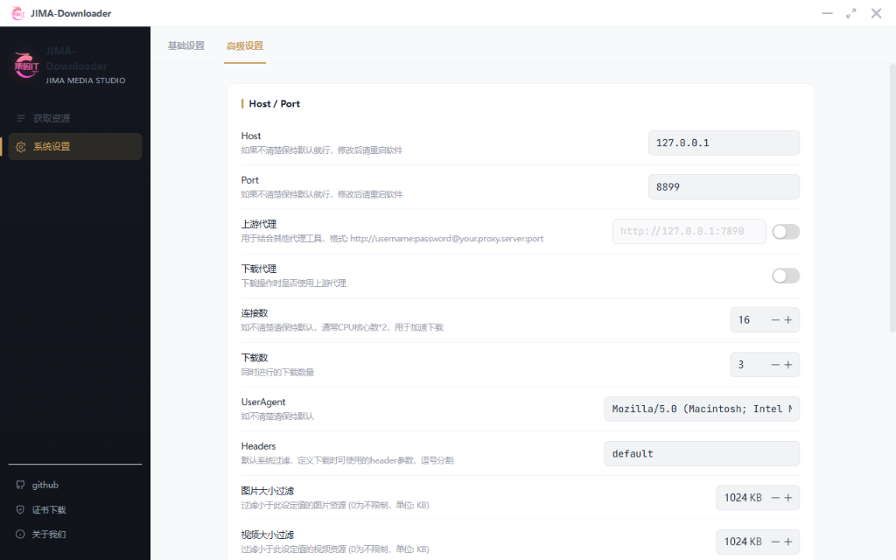
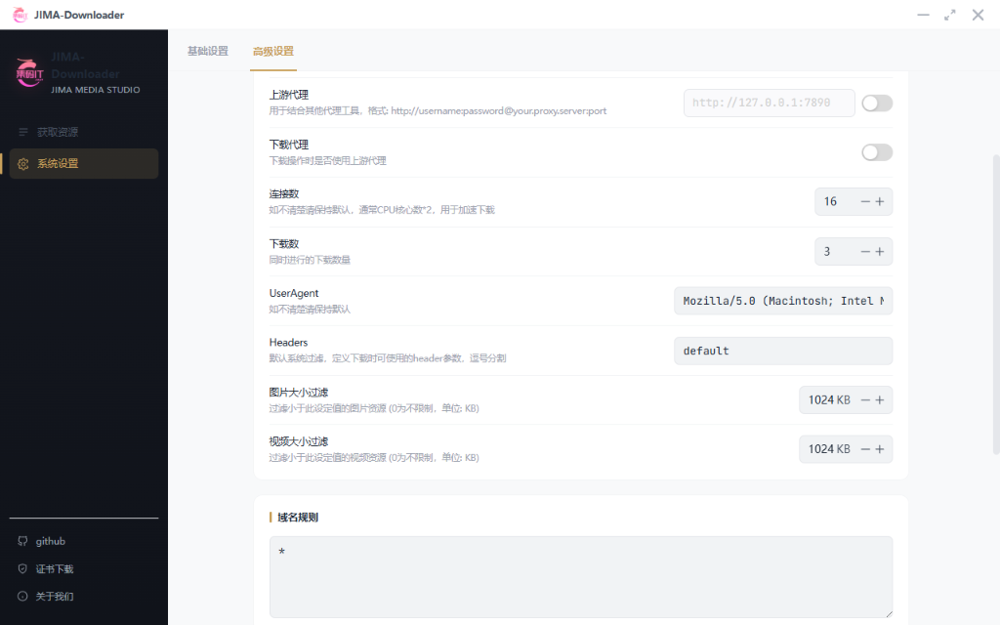

<div align="center">

<a href="https://github.com/icpjimait/res-downloader"></a>
<h1>JIMA-Downloader (Enhanced Edition)</h1>
<p>基于 Go + Wails + Vue 3 的高性能、现代化跨平台网络资源嗅探与下载神器</p>

[](https://github.com/icpjimait/res-downloader/stargazers)
[](https://github.com/icpjimait/res-downloader/fork)
[](https://github.com/icpjimait/res-downloader/releases)
[](https://github.com/icpjimait/res-downloader/actions/workflows/build.yml)
[](https://github.com/icpjimait/res-downloader/blob/master/LICENSE)

</div>

---

> 💡 **特别说明（Enhanced Edition 二次开发版本）**  
> 本项目由 **集码IT (JiMaIT)** 基于原版开源项目 [putyy/res-downloader](https://github.com/putyy/res-downloader) 进行深度二次开发与功能增强。  
> 在完整保留原版全部嗅探与下载能力的基础上，重点对用户体验、嗅探生态、多平台打包和系统级交互进行了深度优化与魔改增强：
> - ⚡ **快手 / B站 / 抖音 / 视频号全生态深度解析**：内置各平台专属插件，自动拦截 API 解析完整标题、作者、封面与音视频直链。
> - 🔍 **顶部常驻全局即时搜索**：无需弹窗即可直接在操作栏进行描述、URL 及域名的实时模糊过滤。
> - 🎛️ **更多操作下拉菜单 UI**：批量操作采用跟手原生下拉菜单（`NDropdown`），告别臃肿弹窗。
> - 🎥 **视频全屏沉浸播放与「直接下载」**：支持边看边直接发起下载，全屏模式支持自适应居中与等比缩放。
> - 📂 **保存路径文件追踪定位**：在保存路径中点击“打开目录”时，直接在操作系统文件管理器中**自动打开并高亮选中**目标文件。
> - 📌 **系统托盘后台运行**：点击窗口关闭按钮不退出，自动最小化缩至系统通知区域托盘，支持快捷唤起。
> - 🛡️ **单实例防多开限制**：防止重复启动导致代理端口冲突，二次打开时自动唤起并置顶已有主窗口。
> - 🚀 **多平台云端自动化构建**：接入 GitHub Actions CI/CD 流水线，一键自动编译发布 Windows、macOS (Universal M系列/Intel) 以及 Linux 安装包。

---

## 🖼️ 界面预览

### 1. 软件主界面与常驻搜索 / 批量操作
> 嗅探捕获多媒体资源列表，支持顶部常驻全局即时搜索、更多操作原生下拉菜单、以及保存路径文件管理器**自动定位高亮选中**：
<div align="center">
  
</div>

### 2. 视频实时预览与「直接下载」
> 预览音视频播放弹窗，右上角集成「直接下载」按钮，支持边预览边直接发起下载并实时联动任务状态：
<div align="center">
  
</div>

### 3. 沉浸式居中全屏播放
> 视频全屏模式支持自适应画面比例（`object-fit: contain`），水平垂直绝对居中，带来沉浸式观影与审核体验：
<div align="center">
  
</div>

### 4. 系统设置与域名高级规则
> 支持保存目录配置、深浅主题切换、智能置灰禁用联动、网络代理与并发连接数精细调优：
<div align="center">
  
  
</div>

---

## ✨ 核心功能与特色

- 🚀 **极致体验**：简洁现代的 UI 界面，支持深色/浅色主题自由切换。
- 🖥️ **全平台支持**：全面支持 **Windows / macOS (Apple Silicon & Intel) / Linux**。
- 📦 **多平台自动构建**：集成 GitHub Actions 云端流水线，多系统安装包自动化编译与发布。
- 🌐 **全类型资源嗅探**：支持视频、音频、图片、m3u8 分片、直播流等多种格式自动捕获。
- 📱 **广泛平台兼容**：
  - **快手（Kuaishou）**：GraphQL / REST API 递归解析，自动获取完整视频标题描述、作者与封面。
  - **哔哩哔哩（B站）**：视频/音频/清晰度识别、音画双轨同频有声预览、FFmpeg 自动混流。
  - **抖音（Douyin）**：自动提取高画质无水印直链与视频描述。
  - **微信视频号**：自动拦截解密密钥，一键视频解密。
  - **小红书、QQ音乐、酷狗** 等主流平台全面支持。
- 🔍 **全局即时搜索**：常驻顶部输入框，毫秒级即时模糊搜索。
- 📂 **保存路径文件追踪**：点击保存目录按钮，直接在系统资源管理器中**自动打开并高亮选中目标文件**。
- 🛡️ **单实例运行限制**：避免多开造成端口冲突，重复打开时**自动唤起置顶已有主窗口并友好提示**。
- 📌 **系统托盘后台运行**：点击关闭按钮可最小化至右下角通知区域托盘，支持左键唤起与右键托盘菜单。
- 🌍 **网络代理与抓包**：内置本地代理服务，一键开启拦截抓包。

---

## 📥 软件下载

前往项目的 **Releases** 页面即可下载对应操作系统的最新版本：

👉 **[前往 Releases 下载最新版本](https://github.com/icpjimait/res-downloader/releases)**

| 操作系统 | 推荐下载文件 | 说明 |
| :--- | :--- | :--- |
| **Windows** | `JIMA-Downloader-windows-amd64.zip` | 解压后双击 `JIMA-Downloader.exe` 即可使用 |
| **macOS** | `JIMA-Downloader-macos-universal.zip` | 通用版本，兼容 M系列芯片 (M1/M2/M3/M4) 及 Intel 芯片 |
| **Linux** | `JIMA-Downloader-linux-amd64.tar.gz` | Linux 64位二进制包 |

---

## 🛠️ 本地开发与构建

### 1. 环境准备
- **Go**：`>= 1.21`
- **Node.js**：`>= 18`
- **Wails CLI**：`go install github.com/wailsapp/wails/v2/cmd/wails@latest`

### 2. 运行开发模式
```bash
# 启动热重载开发环境
wails dev
```

### 3. 构建生产安装包
```bash
# 构建当前操作系统安装包
wails build

# 构建指定平台（如 macOS 通用包）
wails build -platform darwin/universal
```

---

## 💡 实现原理

本工具通过在本地启动轻量代理服务进行网络流量嗅探，并对多媒体资源请求进行智能识别与分类。相比传统抓包工具（如 Fiddler、Charles），本工具对多媒体资源进行了针对性的提取、解密与格式化展示，无需复杂配置即可轻松下载素材。

---

## 🤝 参与贡献与致谢

欢迎提交 Issue 和 Pull Request！

* 原版项目：[putyy/res-downloader](https://github.com/putyy/res-downloader)
* 二次开发维护：[集码IT (JiMaIT)](https://github.com/icpjimait)
* 感谢原作者与所有开源社区贡献者的辛勤付出。

---

## ⚠️ 免责声明

> 本软件仅供个人学习、技术研究与素材备份用途，请勿用于任何商业化或侵犯他人版权的违法行为。  
> 因使用本软件产生的任何法律纠纷与责任，均由使用者自行承担！
